<div align="center">

# ⚽ FootballStream

**Real-time football analytics platform** streaming live standings, match results, and top scorer data from [football-data.org](https://www.football-data.org/) through Apache Kafka into PostgreSQL, visualized on an interactive Spring Boot dashboard.


[Quick Start](#-quick-start) • [Architecture](#-architecture) • [Features](#-features) • [Tech Stack](#-tech-stack) • [API](#-rest-api) • [Testing](#-testing)

</div>

---

## 📖 Overview

FootballStream ingests football data on a schedule, publishes it as events to Kafka, and consumes those events into PostgreSQL — decoupling data collection from data persistence via an event-driven pipeline. A Spring Boot + Thymeleaf dashboard visualizes standings, recent matches, top scorers, team form, and head-to-head comparisons using Chart.js.

Built to demonstrate event-driven architecture, scheduled ETL, and a full Java backend stack: Spring Boot, Spring Kafka, Spring Data JPA, and Docker Compose orchestration.

## 🚀 Quick Start

**Prerequisites:** Docker + Docker Compose, and a free API key from [football-data.org](https://www.football-data.org/client/register).

```bash
git clone https://github.com/vladikv/FootballStream.git
cd FootballStream

echo "FOOTBALL_DATA_TOKEN=your_token_here" > .env

docker compose up -d --build
```

| Service | URL |
|---|---|
| 📊 Dashboard | [http://localhost:8080](http://localhost:8080) |
| 📡 Kafka UI | [http://localhost:8081](http://localhost:8081) |

Data starts populating automatically within 2–3 minutes as the scheduler runs its first sync cycle.

<details>
<summary><strong>What happens on first startup?</strong></summary>

<br>

1. `MatchFetchScheduler` waits 5 seconds, then syncs standings/teams for all 5 leagues (~35s, rate-limited to 1 request per ~7s)
2. After 60 seconds, it syncs matches — each parsed match is published to the `matches.raw` Kafka topic
3. `MatchEventConsumer` reads from Kafka and upserts matches into PostgreSQL
4. After 2 minutes, top scorers sync for each league
5. The dashboard queries PostgreSQL directly via `DashboardService` — no polling needed, data is already there by the time you refresh

</details>

## 🏗 Architecture

```mermaid
flowchart LR
    API["football-data.org API"] -->|"REST, rate-limited"| Scheduler["MatchFetchScheduler"]
    Scheduler --> EtlService["EtlService<br/>(parses JSON, upserts<br/>leagues / teams / standings)"]
    EtlService --> Producer["MatchEventProducer"]
    Producer -->|publish| Kafka["Kafka topic<br/>matches.raw"]
    Kafka -->|consume| Consumer["MatchEventConsumer"]
    Consumer --> DB[("PostgreSQL")]
    DB --> Dash["DashboardService<br/>ApiController"]
    Dash --> UI["Thymeleaf Dashboard<br/>+ Chart.js"]

    style Kafka fill:#0B1220,stroke:#33E1B0,color:#33E1B0
    style DB fill:#0B1220,stroke:#22D3EE,color:#22D3EE
    style UI fill:#0B1220,stroke:#FBBF24,color:#FBBF24
```



**Why Kafka in the middle?** The scheduler polls the API and parses JSON, but instead of writing straight to Postgres, it publishes each match as an event. This means:
- A slow or failed database write never blocks the next API poll
- The `matches.raw` topic can support additional consumers later (a live-score WebSocket feed, an analytics aggregator) without touching the producer
- Match updates are keyed by `apiId`, so Kafka guarantees ordering per match — a later score update can never overwrite an earlier one out of order

<details>
<summary><strong>Why not write directly to Postgres and skip Kafka?</strong></summary>

<br>

A direct API → database write is simpler, but couples ingestion and persistence tightly: if the database is briefly unavailable, you either lose the fetched data or block the scheduler. Kafka decouples the two — the producer's only job is "did I successfully publish this event," while the consumer independently handles retries and persistence. It also mirrors how this kind of pipeline looks in production systems that need to fan data out to multiple downstream consumers.

</details>

## ✨ Features

- **Multi-league coverage** — Premier League, La Liga, Serie A, Bundesliga, Ligue 1
- **Event-driven ETL** — match data flows through Kafka rather than being written directly to the database
- **Scheduled sync** — standings/teams every 30 min, matches every 10 min, top scorers hourly, all rate-limited to respect the free API tier (10 req/min)
- **Interactive dashboard** — league switcher, date-based match browser, team form chart (last 5 results), two-team radar comparison
- **REST API** — JSON endpoints power the dashboard's AJAX interactions independently of the server-rendered pages
- **Fully containerized** — one `docker compose up` starts Postgres, Zookeeper, Kafka, Kafka UI, and the app, with health checks gating startup order
- **CI pipeline** — every push runs a full build + test cycle via GitHub Actions

## 🧰 Tech Stack

| Layer | Technology |
|---|---|
| Language | Java 17 |
| Framework | Spring Boot 3.3 (Web, Data JPA, Kafka, Thymeleaf, Validation) |
| Messaging | Apache Kafka (Confluent images) |
| Database | PostgreSQL 16 |
| Frontend | Thymeleaf, vanilla JS, Chart.js |
| Testing | JUnit 5, Mockito |
| Build | Maven |
| Infra | Docker Compose, GitHub Actions |

## 📂 Project Structure

```
src/main/java/com/football/analytics/
├── client/       # football-data.org API client
├── scheduler/    # @Scheduled jobs driving the ETL cycle
├── service/      # EtlService (parsing/upsert), DashboardService
├── producer/     # Kafka producer
├── consumer/     # Kafka consumer
├── controller/   # DashboardController (Thymeleaf), ApiController (REST/JSON)
├── repository/   # Spring Data JPA repositories
├── model/
│   ├── dto/      # Kafka message + API response DTOs
│   └── entity/   # JPA entities (League, Team, Match, Standing, Player, PlayerStat)
└── config/       # Kafka producer/consumer, RestTemplate config
```

## 🔌 REST API

Used internally by the dashboard's JavaScript for chart interactivity — not just server-rendered pages.

<details>
<summary><strong>GET /api/leagues/{leagueId}/teams</strong></summary>

<br>

Returns all teams in a league, used to populate the form/compare dropdowns.

```json
[
  { "id": 1, "name": "Arsenal FC" },
  { "id": 2, "name": "Chelsea FC" }
]
```

</details>

<details>
<summary><strong>GET /api/leagues/{leagueId}/matches?date=YYYY-MM-DD</strong></summary>

<br>

Returns all matches for a league on a given date — powers the date-browser on the dashboard.

```json
[
  {
    "home": "Arsenal FC",
    "away": "Chelsea FC",
    "homeScore": 2,
    "awayScore": 1,
    "status": "FINISHED",
    "homeCrest": "https://...",
    "awayCrest": "https://..."
  }
]
```

</details>

<details>
<summary><strong>GET /api/teams/{teamId}/form?lastN=5</strong></summary>

<br>

Returns a team's last N finished matches with computed outcomes (W/D/L) — powers the form chart.

</details>

<details>
<summary><strong>GET /api/teams/compare?teamA={id}&teamB={id}</strong></summary>

<br>

Returns a side-by-side standings summary for two teams — powers the radar comparison chart.

</details>

## 🧪 Testing

```bash
mvn test
```

Unit tests cover the parts of the pipeline most likely to silently break:

- **`MatchEventProducerTest`** — verifies events publish to the correct topic with the correct key
- **`MatchEventConsumerTest`** — verifies upsert behavior (new match created vs. existing match updated, never duplicated)
- **`EtlServiceTest`** — verifies team-resolution logic creates a team on the fly when it hasn't been synced yet, instead of silently dropping the match

All tests mock repositories and Kafka via Mockito — no live database or broker required to run them.

## ⚙️ CI/CD

Every push to `main` triggers a GitHub Actions workflow that compiles the project and runs the full test suite. See [`.github/workflows/ci.yml`](.github/workflows/ci.yml).

## 🖼 Screenshots

<!-- Replace with real screenshots: docs/screenshots/*.png -->

| Standings & Matches | Team Comparison |
|---|---|
| _screenshot pending_ | _screenshot pending_ |

## 📄 License

MIT
